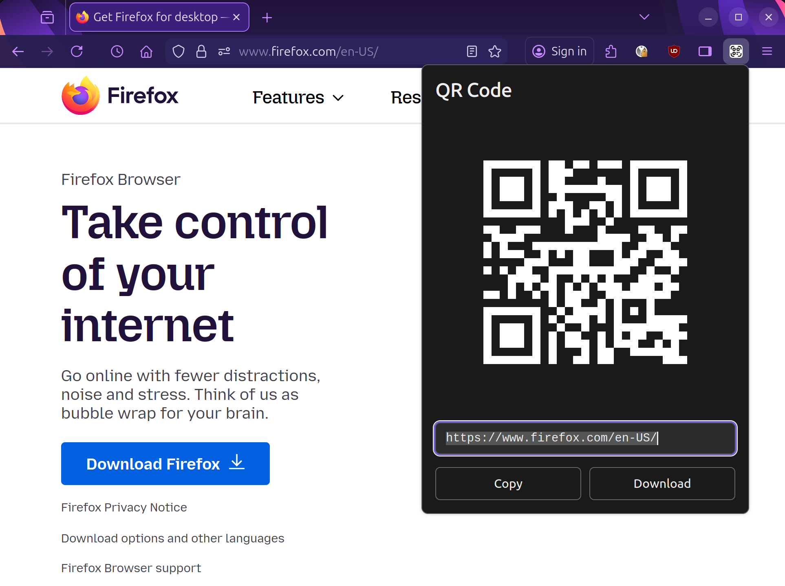

# QR-Fox

[](https://github.com/dodbrian/qr-fox/actions/workflows/ci.yml)

A lightweight Firefox WebExtension that generates QR codes for the current page URL. Built with TypeScript, HTML, and CSS with zero runtime dependencies.

## Features

- **One-click QR code generation** for any webpage
- **Keyboard shortcut** (Alt+Q) for quick access
- **Copy to clipboard** as PNG image
- **Download QR code** as PNG file
- **Zero external dependencies** at runtime
- **Privacy-focused** - all processing happens locally, no data leaves your browser
- **Minimal permissions** - only uses `activeTab` permission

## Screenshot



## Installation

### Quick Install (Recommended)

[](https://addons.mozilla.org/en-US/firefox/addon/qr-fox/)

Click the badge above to visit the official Firefox Add-ons page and install QR-Fox directly in your browser.

### Install from Source (For Developers)

1. Install Node.js 20+
2. Clone this repository:
   ```bash
   git clone https://github.com/dodbrian/qr-fox.git
   cd qr-fox
   ```
3. Install dependencies:
   ```bash
   npm install
   ```
4. Build the extension:
   ```bash
   npm run build
   ```
5. Load in Firefox:
   - Navigate to `about:debugging#/runtime/this-firefox`
   - Click "Load Temporary Add-on"
   - Select the manifest file in the `dist/` directory

### Build Package

```bash
npm run pkg
```

This creates a signed `.xpi` package in `web-ext-artifacts/` that can be installed in Firefox.

## Usage

1. **Click the toolbar icon** or press **Alt+Q** on any webpage
2. A popup displays the QR code for the current URL
3. **Copy** the QR code as PNG to clipboard
4. **Download** the QR code as a PNG file

## Development

### Commands

| Command            | Description                               |
| ------------------ | ----------------------------------------- |
| `npm run build`    | Build extension to `dist/`                |
| `npm run start`    | Build and launch Firefox with extension   |
| `npm test`         | Run test suite                            |
| `npm run lint`     | Check code style                          |
| `npm run format`   | Format code with Prettier                 |
| `npm run validate` | Run all checks (format, lint, test, i18n) |
| `npm run pkg`      | Validate and create `.xpi` package        |

### Project Structure

```
qr-fox/
├── src/
│   ├── background/      # Background script
│   ├── popup/           # Popup UI and QR generation logic
│   ├── icons/           # Extension icons
│   └── manifest.json    # Extension manifest
├── scripts/             # Build and utility scripts
├── __tests__/           # Jest test suite
└── dist/                # Compiled extension (generated)
```

### Tech Stack

- **TypeScript** - Type-safe development
- **ES Modules** - Modern JavaScript module system
- **Jest** - Testing framework with coverage
- **ESLint** - Code quality and style enforcement
- **Prettier** - Code formatting
- **web-ext** - Firefox extension tooling

## Helpful Resources

For developers interested in extending or contributing to QR-Fox, here are some valuable resources:

- [Mozilla Add-on Developer Hub](https://addons.mozilla.org/en-US/developers/) - Resources for extension development, publishing, and managing your extensions on addons.mozilla.org
- [Mozilla WebExtensions Documentation](https://developer.mozilla.org/en-US/docs/Mozilla/Add-ons/WebExtensions) - Comprehensive guides and references for building Firefox extensions with the WebExtensions API
- [Extension Signing and Distribution Overview](https://extensionworkshop.com/documentation/publish/signing-and-distribution-overview/) - Details about Firefox's extension signing process and distribution options
- [Add-ons Server API v4 Signing Documentation](https://mozilla.github.io/addons-server/topics/api/v4_frozen/signing.html) - Technical documentation for the API used to programmatically sign Firefox extensions

## Contributing

See [AGENTS.md](./AGENTS.md) for detailed coding guidelines, build instructions, and contribution rules.

### Quick Guidelines

- Follow TypeScript strict mode
- Add tests for new features
- Run `npm run validate` before committing
- Use conventional commit format: `<type>(<scope>): <subject>`

## License

MIT License - see LICENSE file for details

## Attributions

QR code icon sourced from [Freepik](https://www.freepik.com)

## Browser Compatibility

- Firefox 115+
- Manifest V3

## Privacy

QR-Fox processes all data locally in your browser. No information is transmitted to external servers. The extension only requests `activeTab` permission to read the current page URL.
